```mermaid
flowchart TB
    classDef frontend fill:#1e3a5f,stroke:#4a90d9,color:#e8f4fd
    classDef api      fill:#1a3a2a,stroke:#4caf50,color:#e8f7ed
    classDef worker   fill:#3b1f0a,stroke:#ff8c00,color:#fff5e6
    classDef infra    fill:#2d1b4e,stroke:#9c27b0,color:#f3e5f5
    classDef db       fill:#1a1a3a,stroke:#5c6bc0,color:#e8eaf6
    classDef ext      fill:#2a1a1a,stroke:#ef5350,color:#fce4ec
    classDef rl       fill:#0d2b1a,stroke:#26a69a,color:#e0f2f1

    USER(["Warehouse Manager"])

    subgraph Frontend["Frontend — React / Vite / TypeScript"]
        direction LR
        S1["Stage 1: Data Ingestion\nCSV/Excel upload\nSynthetic demand gen\nSKU selector\nDetect demand params\nStage-1 LLM Copilot"]:::frontend
        S2["Stage 2: Demand Shaping\nInteractive chart editor\nAdd / remove spikes\nScale date ranges\nStage-2 LLM Copilot"]:::frontend
        S3["Stage 3: RL Training\nHyperparameter config\nLive reward chart via WS\nEpsilon decay bar\nStage-3 LLM Copilot"]:::frontend
        S4["Stage 4: Evaluation\nRL vs Oracle vs Rule\nCumulative reward table\nRL/Oracle ratio display\nStage-4 LLM Copilot"]:::frontend
        S5["Stage 5: Deployment Sim\nDay-by-day stepper\nHuman override input\nMulti-SKU KPI board\nStage-5 LLM Copilot"]:::frontend
    end

    USER --> S1 --> S2 --> S3 --> S4 --> S5

    subgraph Backend["FastAPI Backend — Python / Uvicorn"]
        direction TB
        subgraph DemandAPI["Demand API"]
            DA1["POST /demand/upload\nCSV / Excel / SKU detect"]:::api
            DA2["POST /demand/generate\nSummer or Winter synthetic"]:::api
            DA3["POST /demand/modify\nSpike / scale / reset"]:::api
            DA4["GET  /demand/params\nDetected parameters"]:::api
        end
        subgraph TrainAPI["Training API"]
            TA1["POST /train\nPublish job to RabbitMQ"]:::api
            TA2["GET  /train/status\nEpisode / reward / epsilon"]:::api
            TA3["WS   /ws/training\nLive broadcast relay"]:::api
        end
        subgraph EvalAPI["Evaluation API"]
            EA1["POST /evaluate\nRun RL + Oracle + Rule-Based"]:::api
            EA2["GET  /evaluate/results\nReturn metrics + graphs"]:::api
        end
        subgraph DeployAPI["Deployment API"]
            DP1["POST /deploy/step\nAdvance N simulation days"]:::api
            DP2["POST /deploy/override\nSet human override qty"]:::api
            DP3["GET  /deploy/status\nKPI dashboard data"]:::api
        end
        subgraph MultiAPI["Multi-SKU API"]
            MA1["POST /multi/train-all\nParallel SKU job publish"]:::api
            MA2["GET  /multi/status\nPer-SKU progress"]:::api
        end
        WSMgr["WebSocket Manager\nTrainingWSManager\nbroadcast_from_thread()"]:::api
    end

    S1 <-->|REST JSON| DemandAPI
    S2 <-->|REST JSON| DemandAPI
    S3 <-->|REST JSON| TrainAPI
    S3 <-.->|WebSocket live updates| WSMgr
    S4 <-->|REST JSON| EvalAPI
    S5 <-->|REST JSON| DeployAPI
    S3 <-->|REST JSON| MultiAPI

    subgraph RLEngine["RL Engine — Python Modules"]
        direction LR
        DemPy["demand.py\ngenerate_demand()\nBrownian motion model\npromo flag derivation"]:::rl
        EnvPy["environment.py\nInventoryEnvironment\n15-D state vector\nDiscrete action space\nLost-sales reward model"]:::rl
        DqnPy["dqn.py\nDQN: 512-512-256\nDQNAgent\nReplayBuffer + Welford\nDouble DQN / Huber loss\nPolyak tau=0.005"]:::rl
        TrPy["trainer.py\ntrain_agent()\nAdaptive Q_max + Delta\nOracle policy W=5\nRule-based s,S baseline\nGreedy eval every 100 ep"]:::rl
        DemPy --> EnvPy --> DqnPy --> TrPy
    end

    TrainAPI --> RLEngine
    EvalAPI  --> RLEngine

    subgraph MQ["RabbitMQ — Message Queue"]
        direction LR
        JobsX["jobs exchange\nTraining requests\none message per SKU"]:::infra
        ProgressX["progress exchange\nFanout broadcast\nper-episode updates"]:::infra
    end

    TA1 -->|publish training job| JobsX

    subgraph Workers["Worker Pool — Python Processes"]
        direction LR
        W1["Worker 1\nSKU-A training\n500 episodes"]:::worker
        W2["Worker 2\nSKU-B training\n500 episodes"]:::worker
        W3["Worker N\nSKU-N training\n500 episodes"]:::worker
    end

    JobsX -->|consume job| W1
    JobsX -->|consume job| W2
    JobsX -->|consume job| W3
    W1 -->|episode progress| ProgressX
    W2 -->|episode progress| ProgressX
    W3 -->|episode progress| ProgressX
    ProgressX -->|subscribe| WSMgr
    WSMgr -->|WS push events| S3

    subgraph Database["PostgreSQL — Persistent Storage"]
        direction TB
        TUF["uploaded_files\nid, filename, filepath\nfile_type, skus JSON\nuploaded_at"]:::db
        TTR["training_runs\nid, sku, season_type\nepisodes, best_reward\nrewards JSON, model_path\nstatus, started_at"]:::db
        TER["evaluation_results\nid, training_run_id\nrl_reward, oracle_reward\nrule_reward\nrl_vs_oracle_pct\neval_graph_path"]:::db
        TUF --> TTR --> TER
    end

    DemandAPI -->|persist file metadata| TUF
    TA1       -->|create TrainingRun row| TTR
    W1 -->|save weights + rewards| TTR
    W2 -->|save weights + rewards| TTR
    W3 -->|save weights + rewards| TTR
    EA1 -->|write eval metrics| TER
    DeployAPI -->|load model for sim| TTR

    subgraph External["External Services"]
        Groq["Groq API\nLlama-3.3-70B\nPage-scoped system prompts\nStage 1-5 copilots\nJSON action responses"]:::ext
    end

    S1 <-->|HTTPS LLM inference| Groq
    S2 <-->|HTTPS LLM inference| Groq
    S3 <-->|HTTPS LLM inference| Groq
    S4 <-->|HTTPS LLM inference| Groq
    S5 <-->|HTTPS LLM inference| Groq

    FileStore["File Storage\nuploads/ — CSV, Excel files\nstorage/ — model .pt weights\n          — evaluation graphs"]:::infra
    DemandAPI --> FileStore
    W1 --> FileStore
    W2 --> FileStore
    W3 --> FileStore
    EA1 --> FileStore
```

# Diagram 01 — High-Level System Architecture

**Scope**: Full system from user to storage  
**Last Updated**: 2026-06-03  
**Related Spec**: [specs/architecture/system-overview.md](../specs/architecture/system-overview.md)

---

---

## Change Log

| Date | Change | Author |
|------|--------|--------|
| 2026-06-03 | Initial diagram — ported from replenix_architecture.md | @sujaynimmagadda |
