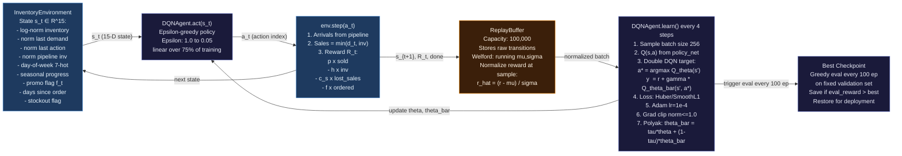

# Diagram 02 — RL Agent Internal Data Flow

**Scope**: DQN agent internals — state, action, environment, replay buffer, learning  
**Last Updated**: 2026-06-03  
**Related Spec**: [specs/architecture/rl-agent-design.md](../specs/architecture/rl-agent-design.md)  
**Source Files**: `Backend-RL/src/dqn.py`, `Backend-RL/src/environment.py`, `Backend-RL/src/trainer.py`

---

---

## Key Parameters

| Parameter | Value | Location |
|-----------|-------|----------|
| State dimensions | 15 | `environment.py` |
| Action space | Discrete (order qty steps) | `environment.py` |
| Replay buffer capacity | 100,000 | `dqn.py` |
| Batch size | 256 | `dqn.py` |
| Learning rate | 1e-4 | `dqn.py` |
| Polyak tau | 0.005 | `dqn.py` |
| Epsilon range | 1.0 → 0.05 | `trainer.py` |
| Eval frequency | Every 100 episodes | `trainer.py` |

---

## Change Log

| Date | Change | Author |
|------|--------|--------|
| 2026-06-03 | Initial diagram — ported from replenix_architecture.md | @sujaynimmagadda |
