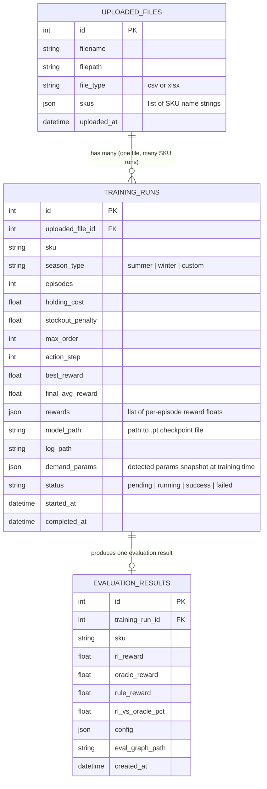

# Diagram 03 — Database Schema (ERD)

**Scope**: PostgreSQL schema — all tables, columns, relationships  
**Last Updated**: 2026-06-03  
**Related Spec**: [specs/architecture/data-model.md](../specs/architecture/data-model.md)  
**Source Files**: `Backend-RL/src/models.py`, `Backend-RL/alembic/`, `Frontend/shared/`

---

---

## Notes

- `training_runs.rewards` stores raw per-episode reward history as JSON array — used for reward chart on frontend
- `training_runs.demand_params` is a snapshot of demand params at training time, so evaluation is reproducible even if demand is later changed
- `training_runs.model_path` points to a `.pt` file in the shared `backend_storage` Docker volume
- `evaluation_results.eval_graph_path` stores the file path of the saved matplotlib comparison graph

---

## Change Log

| Date | Change | Author |
|------|--------|--------|
| 2026-06-03 | Initial ERD — ported from replenix_architecture.md | @sujaynimmagadda |
