```mermaid
sequenceDiagram
    actor Manager as Warehouse Manager
    participant FE as React Frontend
    participant API as FastAPI Backend
    participant MQ as RabbitMQ
    participant WK as Worker Pool
    participant DB as PostgreSQL
    participant LLM as Groq LLM

    rect rgb(20, 50, 80)
        note over Manager,LLM: Stage 1 — Data Ingestion
        Manager->>FE: Upload CSV or click Generate Summer
        FE->>API: POST /api/demand/upload or /generate
        API->>DB: INSERT uploaded_files row
        API-->>FE: UploadResponse with dates, demand, detected_params
        Manager->>FE: Ask copilot: "generate 180 days winter"
        FE->>LLM: System prompt with Stage-1 actions only
        LLM-->>FE: JSON action {type: generate, season: winter}
        FE->>API: POST /api/demand/generate
        API-->>FE: ModifyResponse with new demand series
    end

    rect rgb(20, 50, 30)
        note over Manager,LLM: Stage 2 — Demand Shaping
        Manager->>FE: Drag chart spike or type command
        FE->>API: POST /api/demand/modify/spike
        API-->>FE: Updated demand series
        FE->>FE: Re-render chart with new data
    end

    rect rgb(60, 40, 10)
        note over Manager,LLM: Stage 3 — RL Training
        Manager->>FE: Configure hyperparams and click Train
        FE->>API: POST /api/train with episodes, holding_cost, decay_type
        API->>MQ: Publish job message per SKU
        API->>DB: INSERT training_runs status=pending
        API-->>FE: run_id and status=initiated
        FE->>API: WS /ws/training connect
        MQ->>WK: Consume job — one worker per SKU
        loop Every episode
            WK->>MQ: Publish episode progress {ep, reward, epsilon, best_eval}
            MQ->>API: ProgressListener callback
            API->>FE: WS broadcast episode event
            FE->>FE: Update live reward chart
        end
        WK->>DB: UPDATE training_runs with rewards and best_reward
        WK->>DB: Save model .pt path to model_path column
        WK->>MQ: Publish status=completed message
        API->>FE: WS broadcast completed event
    end

    rect rgb(20, 20, 60)
        note over Manager,LLM: Stage 4 — Evaluation
        Manager->>FE: Click Evaluate
        FE->>API: POST /api/evaluate
        API->>DB: Load model weights from training_runs
        API->>API: Run greedy RL episode (epsilon=0)
        API->>API: Run oracle policy (W=5 day lookahead)
        API->>API: Run rule-based s,S baseline
        API->>DB: INSERT evaluation_results row
        API-->>FE: rl_reward, oracle_reward, rule_reward, ratios, graphs
        FE->>FE: Render comparison table and inventory charts
    end

    rect rgb(50, 20, 50)
        note over Manager,LLM: Stage 5 — Deployment Simulation
        Manager->>FE: Click Step Day or set override
        FE->>API: POST /api/deploy/step or /deploy/override
        API->>API: DeploymentSimulator.step() with RL action or override
        API-->>FE: inventory, demand, rl_action, reward, health
        FE->>FE: Update KPI dashboard and health badges
    end
```

# Diagram 04 — Stage-by-Stage Sequence Flow

**Scope**: Full user journey: Warehouse Manager through Stage 1–5 with LLM copilot interactions  
**Last Updated**: 2026-06-03  
**Related Spec**: [specs/architecture/system-overview.md](../specs/architecture/system-overview.md)

---

---

## Change Log

| Date | Change | Author |
|------|--------|--------|
| 2026-06-03 | Initial sequence diagram — ported from replenix_architecture.md | @sujaynimmagadda |
