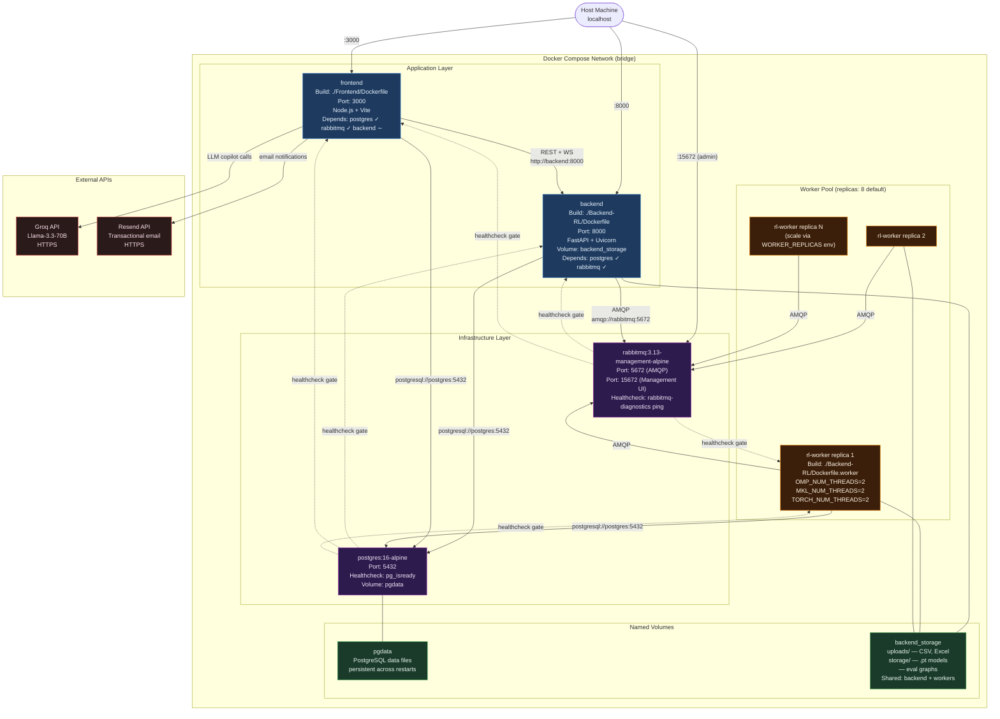

# Diagram 05 — Docker Deployment Architecture

**Scope**: Docker Compose services, networks, volumes, healthchecks, dependencies  
**Last Updated**: 2026-06-03  
**Source File**: [docker-compose.yml](../docker-compose.yml), [docker-compose.prod.yml](../docker-compose.prod.yml)

---

---

## Environment Variables

| Variable | Default | Used By |
|----------|---------|---------|
| `POSTGRES_USER` | `postgres` | postgres, backend, frontend, workers |
| `POSTGRES_PASSWORD` | `postgres` | postgres, backend, frontend, workers |
| `POSTGRES_DB` | `inventory` | postgres, backend, frontend, workers |
| `RABBITMQ_DEFAULT_USER` | `guest` | rabbitmq, backend, frontend, workers |
| `RABBITMQ_DEFAULT_PASS` | `guest` | rabbitmq, backend, frontend, workers |
| `WORKER_REPLICAS` | `8` | rl-worker deploy.replicas |
| `GROQ_API_KEY` | *(required)* | backend |
| `RESEND_API_KEY` | *(required)* | frontend |
| `BACKEND_PUBLIC_URL` | `http://localhost:8000` | frontend |

---

## Change Log

| Date | Change | Author |
|------|--------|--------|
| 2026-06-03 | Initial diagram — derived from docker-compose.yml | @sujaynimmagadda |
