```mermaid
flowchart LR
    classDef api     fill:#1a3a2a,stroke:#4caf50,color:#e8f7ed
    classDef mq      fill:#2d1b4e,stroke:#9c27b0,color:#f3e5f5
    classDef worker  fill:#3b1f0a,stroke:#ff8c00,color:#fff5e6
    classDef ws      fill:#1e3a5f,stroke:#4a90d9,color:#e8f4fd
    classDef db      fill:#1a1a3a,stroke:#5c6bc0,color:#e8eaf6

    subgraph Producers["API — Job Publishers"]
        TA1["POST /train\nPublish 1 job per SKU"]:::api
        MA1["POST /multi/train-all\nPublish N jobs (batch)"]:::api
    end

    subgraph RabbitMQ["RabbitMQ Broker"]
        direction TB
        JobsExchange["jobs exchange\nType: direct\nDurable: true\nOne message per SKU training job"]:::mq
        JobsQueue["jobs queue\nDurable: true\nAck on successful start\nRequeue on worker crash"]:::mq
        ProgressExchange["progress exchange\nType: fanout\nBroadcasts to ALL listeners"]:::mq
        ProgressQueue["progress queue\nEphemeral per consumer\nAuto-delete on disconnect"]:::mq
        JobsExchange --> JobsQueue
        ProgressExchange --> ProgressQueue
    end

    TA1 -->|"Publish: {sku, episodes, hyperparams, run_id}"| JobsExchange
    MA1 -->|"Publish N messages"| JobsExchange

    subgraph Workers["Worker Pool (N replicas)"]
        direction TB
        W1["Worker 1\nConsumes 1 job\nTrains SKU-A\n500 episodes"]:::worker
        W2["Worker 2\nConsumes 1 job\nTrains SKU-B\n500 episodes"]:::worker
        WN["Worker N\nConsumes 1 job\nTrains SKU-N\n500 episodes"]:::worker
    end

    JobsQueue -->|"basic_get / basic_consume"| W1
    JobsQueue -->|"basic_get / basic_consume"| W2
    JobsQueue -->|"basic_get / basic_consume"| WN

    subgraph WorkerActions["Per Worker — Each Episode"]
        direction TB
        WA1["Run training episode"]:::worker
        WA2["Publish progress event\n{run_id, episode, reward,\nepsilon, best_eval, status}"]:::worker
        WA3["UPDATE training_runs in DB"]:::db
        WA4["Save .pt checkpoint to disk"]:::worker
        WA1 --> WA2 --> WA3
        WA1 --> WA4
    end

    W1 -->|"episode updates"| ProgressExchange
    W2 -->|"episode updates"| ProgressExchange
    WN -->|"episode updates"| ProgressExchange

    subgraph ProgressListener["API — Progress Subscriber"]
        PL["ProgressListener thread\nSubscribes to progress exchange\nRuns in background on API startup"]:::api
        WSMgr["WebSocket Manager\nTrainingWSManager\nbroadcast_from_thread()"]:::ws
        PL -->|"on message received"| WSMgr
    end

    ProgressQueue -->|"fanout delivery"| PL

    subgraph Frontend["React Frontend — Stage 3"]
        WS["WebSocket client\n/ws/training"]:::ws
        Chart["Live reward chart\nEpsilon decay bar\nStatus badges"]:::ws
        WS --> Chart
    end

    WSMgr -->|"WS push: episode event"| WS
```

# Diagram 06 — RabbitMQ Message Flow

**Scope**: RabbitMQ exchanges, queues, routing, worker consumption, progress fanout  
**Last Updated**: 2026-06-03  
**Source Files**: `Backend-RL/src/queue_service.py`, `Backend-RL/src/worker.py`, `Backend-RL/src/app.py`

---



---

## Message Schemas

### Job Message (API → jobs exchange)
```json
{
  "run_id": 42,
  "sku": "SKU-A",
  "episodes": 500,
  "holding_cost": 0.5,
  "stockout_penalty": 5.0,
  "max_order": 100,
  "action_step": 10,
  "demand_params": { "mean": 50.0, "std": 12.0, "trend": 0.01 }
}
```

### Progress Message (worker → progress exchange)
```json
{
  "run_id": 42,
  "sku": "SKU-A",
  "episode": 237,
  "reward": 1842.5,
  "epsilon": 0.42,
  "best_eval": 2011.0,
  "status": "running"
}
```

### Completion Message (worker → progress exchange)
```json
{
  "run_id": 42,
  "sku": "SKU-A",
  "episode": 500,
  "best_reward": 2011.0,
  "model_path": "/app/storage/sku_a_run42.pt",
  "status": "completed"
}
```

---

## Change Log

| Date | Change | Author |
|------|--------|--------|
| 2026-06-03 | Initial diagram — derived from queue_service.py + worker.py | @sujaynimmagadda |
