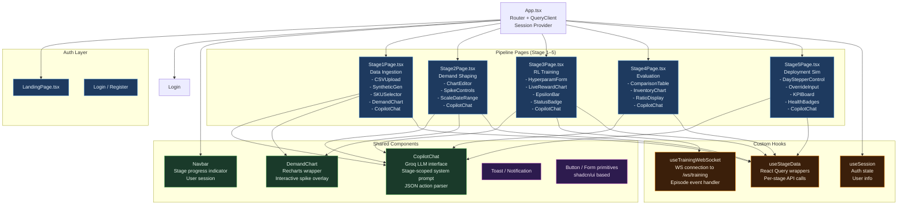

# Diagram 07 — Frontend Component Tree

**Scope**: React component hierarchy — App root through Stage 1–5 pages and shared components  
**Last Updated**: 2026-06-03  
**Source Directory**: `Frontend/client/src/`

---



---

## Key Routing Structure

```
/                   → LandingPage
/login              → Login
/register           → Register
/stage/1            → Stage1Page (Data Ingestion)
/stage/2            → Stage2Page (Demand Shaping)
/stage/3            → Stage3Page (RL Training)
/stage/4            → Stage4Page (Evaluation)
/stage/5            → Stage5Page (Deployment Sim)
```

---

## Change Log

| Date | Change | Author |
|------|--------|--------|
| 2026-06-03 | Initial component tree — derived from Frontend/client/src | @sujaynimmagadda |
