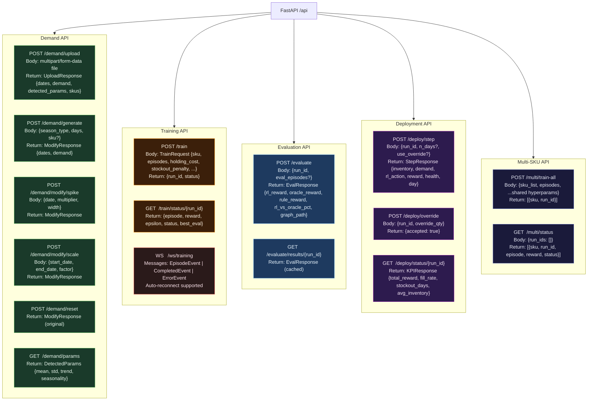
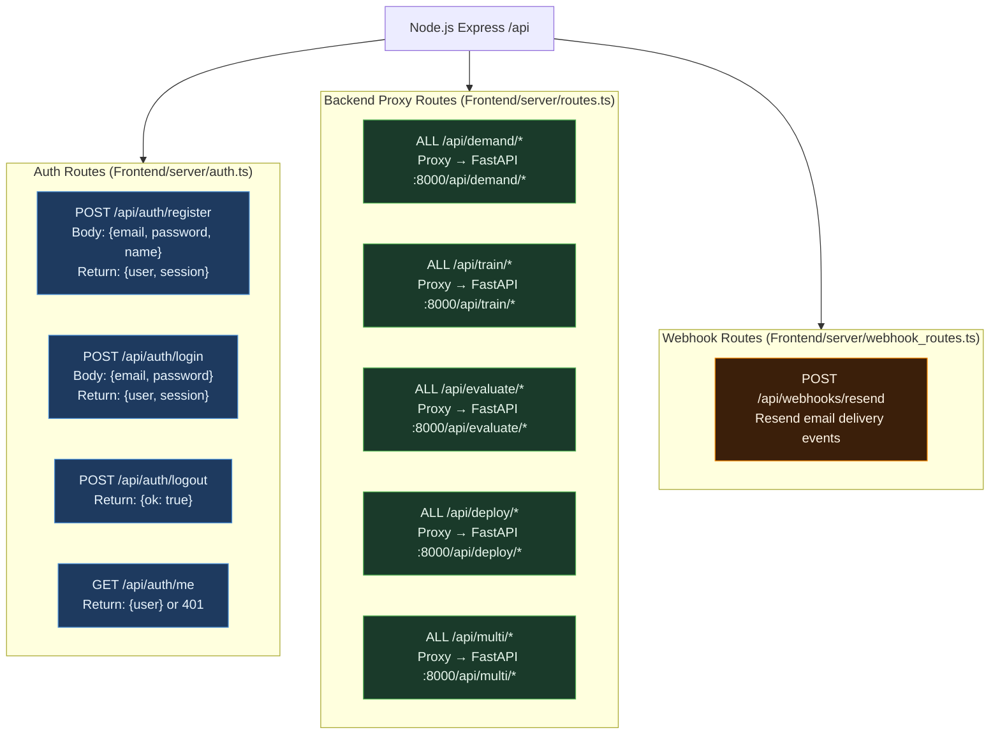

# Diagram 08 — API Contracts (All Endpoints)

**Scope**: Complete REST + WebSocket endpoint reference for both FastAPI (Backend-RL) and Node.js (Frontend server)  
**Last Updated**: 2026-06-03  
**Source Files**: `Backend-RL/src/app.py`, `Backend-RL/src/schemas.py`, `Frontend/server/routes.ts`

---

## FastAPI Backend (port 8000)



---

## Node.js Frontend Server (port 3000)



---

## WebSocket Event Schemas

### EpisodeEvent
```json
{ "type": "episode", "run_id": 42, "sku": "SKU-A",
  "episode": 237, "reward": 1842.5, "epsilon": 0.42, "best_eval": 2011.0 }
```

### CompletedEvent
```json
{ "type": "completed", "run_id": 42, "sku": "SKU-A",
  "best_reward": 2011.0, "model_path": "/app/storage/sku_a_run42.pt" }
```

### ErrorEvent
```json
{ "type": "error", "run_id": 42, "sku": "SKU-A", "message": "OOM during training" }
```

---

## Change Log

| Date | Change | Author |
|------|--------|--------|
| 2026-06-03 | Initial API contracts diagram — derived from app.py + schemas.py + routes.ts | @sujaynimmagadda |
