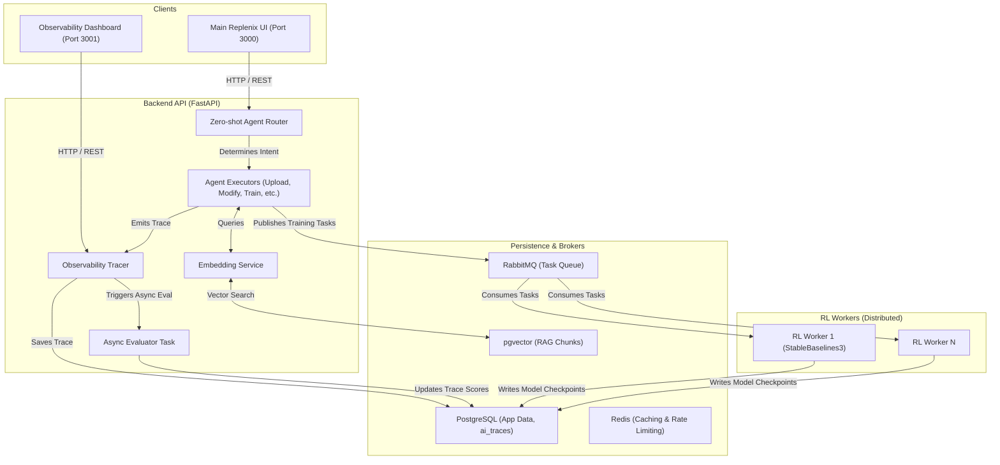

# Combined Architecture

Replenix relies on a tightly integrated but fully modular architecture. Below is the macroscopic view of how the Frontend, Backend APIs, RL Workers, RAG Pipeline, and Observability layers all interact.

## Macro System Architecture

## System Tenets
1. **Asynchronous by Default**: Heavy tasks (RL training, Trace evaluation, Embedding generation) are strictly offloaded from the main API thread.
2. **Specialized Agents**: RAG is not a hammer. Specialized agents (like the Modify agent) can execute strict actions without forcing RAG vocabulary overlaps.
3. **Decoupled Dashboards**: Administrative and operational views (Observability, Grafana) are maintained as independent applications to keep the main user interface lightweight.
