# Observability Architecture

The AI Observability Layer in Replenix is completely decoupled from the main application to ensure zero impact on user request latency while providing deep visibility into the AI's internal reasoning.

## High-Level Flow

```mermaid
sequenceDiagram
    participant User
    participant MainAPI as Replenix Backend API
    participant DB as Postgres (ai_traces)
    participant EvalTask as Background Evaluator
    participant ObsUI as Observability Dashboard
    
    User->>MainAPI: User Chat Request
    
    rect rgb(20, 30, 50)
    Note over MainAPI, DB: 1. Synchronous Tracing
    MainAPI->>MainAPI: Run Agent & RAG
    MainAPI->>DB: INSERT INTO ai_traces (question, answer, is_action, latency)
    end
    
    MainAPI->>User: Return Answer (Fast Response)
    
    rect rgb(50, 20, 20)
    Note over MainAPI, DB: 2. Asynchronous Evaluation
    MainAPI-)EvalTask: Trigger evaluate_trace() Background Task
    EvalTask->>DB: SELECT Trace
    EvalTask->>EvalTask: Calculate Relevance (Cosine)
    EvalTask->>EvalTask: Calculate Groundedness (Token Overlap)
    EvalTask->>DB: UPDATE ai_traces SET scores, hallucination_flag
    end
    
    ObsUI->>DB: Poll Metrics & Traces
    ObsUI-->>Admin: Display Dashboard
```

## Key Components

1. **Synchronous Tracing**: When the LLM responds, the Orchestrator immediately emits a trace row containing the raw question, answer, RAG chunks, token counts, and whether the response was an "action" (e.g., parameter update) or an "answer". This happens synchronously to ensure no data loss.
2. **Asynchronous Evaluation**: Once the trace is emitted and the user receives their response, a `FastAPI BackgroundTask` picks up the trace ID. It calculates relevance scores (cosine similarity of embeddings) and groundedness (RAG chunk overlap). 
3. **Action-Aware Scoring**: If `is_action` is True, the evaluator bypasses groundedness checks to prevent false positive "hallucination" flags for purely operational agent commands.
4. **Standalone Dashboard**: The Observability UI runs as an independent application (on port 3001) querying the backend metrics APIs, ensuring the main application remains lightweight.
