# RAG Architecture

Replenix uses a Retrieval-Augmented Generation (RAG) pipeline to ground the LLM responses in real-world data and context. This document outlines the architecture of our RAG system.

## High-Level Flow

```mermaid
sequenceDiagram
    participant User
    participant Orchestrator
    participant RAG_Router as Agent Router
    participant Embedder as Embedding Service
    participant PGVector as PostgreSQL (pgvector)
    participant LLM as Groq LLM
    
    User->>Orchestrator: Asks Question
    Orchestrator->>RAG_Router: Determine Intent
    RAG_Router-->>Orchestrator: Selected Agent (e.g. Modify)
    
    rect rgb(20, 30, 50)
    Note over Orchestrator, PGVector: Retrieval Phase
    Orchestrator->>Embedder: embed_text(Query)
    Embedder-->>Orchestrator: Vector [1536]
    Orchestrator->>PGVector: Cosine Similarity Search (top_k=4)
    PGVector-->>Orchestrator: Relevant Context Chunks
    end
    
    rect rgb(30, 20, 50)
    Note over Orchestrator, LLM: Generation Phase
    Orchestrator->>LLM: System Prompt + History + Context Chunks
    LLM-->>Orchestrator: Generated Answer / Action
    end
    
    Orchestrator->>User: Formatted Response
```

## Key Components

1. **Embedding Service**: We use a robust embedding model to map textual chunks and user queries into a high-dimensional vector space.
2. **Vector Database**: `pgvector` inside PostgreSQL stores our context chunks. This allows us to combine semantic similarity searches (using cosine distance `<=>`) with traditional relational filtering (e.g., filtering by `sku_id` or `stage`).
3. **Agent Router**: Not every question requires RAG. The orchestrator uses a specialized zero-shot router to determine if the question is navigational, conversational, or if it requires deep context retrieval. RAG is only triggered for the latter.

## Chunking Strategy
- **Granularity**: Documents and metrics are chunked into semantic segments to preserve context across boundaries.
- **Metadata**: Every chunk in `pgvector` includes metadata such as `source`, `stage`, and `sku_id` to allow hybrid search filtering.
