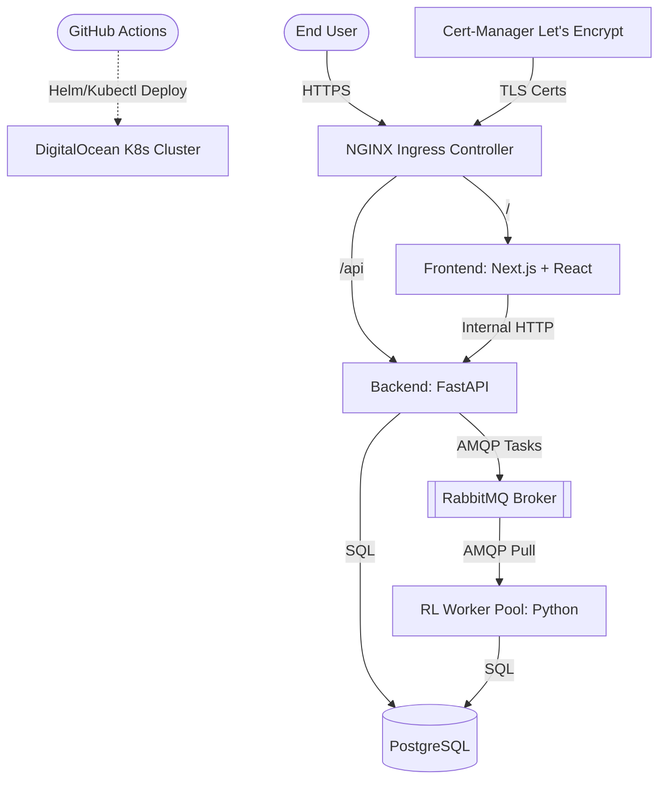

# Replenix System Architecture

This document provides a comprehensive overview of the Replenix cloud architecture, detailing the microservices, infrastructure, security protocols, and CI/CD pipelines.

## 1. High-Level Architecture Overview

Replenix is an intelligent supply chain optimization engine powered by Reinforcement Learning. It consists of multiple independent, symmetrically scalable microservices communicating via HTTP and AMQP, backed by persistent data storage.

## 2. Microservices Detail

### Frontend (Next.js / Vite)
- **Role:** Presents the interactive dashboard for scenario modeling, data uploads, and reinforcement learning simulation previews.
- **Tech Stack:** React, Tailwind CSS, Shadcn UI.
- **Scaling:** Stateless, can be horizontally scaled infinitely.

### Backend API (FastAPI)
- **Role:** Handles core business logic, user authentication, file uploads, and acts as the bridge between the UI and the asynchronous RL worker pool.
- **Tech Stack:** Python, FastAPI, SQLAlchemy, Alembic.
- **Scaling:** Stateless, scaled horizontally.

### RL Worker Pool
- **Role:** A dedicated background processing pool specifically designed to run heavy Deep Q-Network (DQN) training sessions without blocking the web server.
- **Autoscaling:** Managed by **KEDA** (Kubernetes Event-driven Autoscaling), which scales the number of pods from `0` to `N` depending on the queue length in RabbitMQ.

### RabbitMQ
- **Role:** The message broker facilitating asynchronous communication between the Backend API and the RL Worker Pool. Stores training tasks until an RL worker is available to process them.

### PostgreSQL
- **Role:** The source of truth for the application. Stores user credentials, simulation scenarios, training results, and analytics telemetry.
- **Storage:** Uses Persistent Volume Claims (PVCs) to survive pod restarts.

## 3. Kubernetes Infrastructure

Replenix is designed to run on a Managed Kubernetes cluster (e.g., DigitalOcean Kubernetes). 

### Ingress & TLS Validation
- **NGINX Ingress Controller:** Acts as the reverse proxy routing external traffic into the cluster based on subdomains (`api-preprod.replenix.app` vs `preprod.replenix.app`).
- **Cert-Manager:** Automatically provisions and renews TLS certificates via Let's Encrypt using HTTP-01 challenges, ensuring the site is fully HTTPS secured.

### Zero-Trust Security (Network Policies)
Replenix employs strict zero-trust security within the Kubernetes cluster.
- A `default-deny-all` Network Policy blocks **all** incoming and outgoing traffic by default.
- Specific policies explicitly whitelist required traffic:
  - `allow-ingress-to-frontend`: Ingress -> Frontend.
  - `allow-ingress-to-backend`: Ingress -> Backend.
  - `backend-egress` / `rl-worker-egress`: Pods -> PostgreSQL / RabbitMQ.
  - `rabbitmq-ingress` / `postgres-ingress`: Limits DB access solely to backend and worker pods.

## 4. Environment Separation

The application is deployed across three isolated environments:

1. **Dev (Local):** Runs via Docker Compose. Uses local bind mounts for fast iteration.
2. **Preprod (Staging):** Runs in the `replenix-preprod` Kubernetes namespace. Acts as a production clone for final integration testing, smoke tests, and QA.
3. **Prod (Production):** Runs in the `replenix-prod` Kubernetes namespace. The live, public-facing application.

## 5. CI/CD Pipeline

The unified GitHub Actions pipeline (`.github/workflows/ci-cd.yml`) handles automated testing and deployments:
1. **Trigger:** Push to `dev`, `preprod` or `prod` branches.
2. **Testing:** Executes Pytest backend and E2E Playwright tests on all branches.
3. **Build:** If tests pass on `preprod` or `prod`, Docker images are built and pushed to DigitalOcean Container Registry (DOCR).
4. **Secret Provisioning:** Base64 encodes GitHub Secrets and creates Kubernetes Secret manifests on the fly.
5. **Deploy:** Replaces image tags with the current Git SHA and applies manifests via `kubectl apply`.
6. **Rollout Verification:** Waits for pods to report `Ready=True`.
7. **Smoke Test:** Executes internal curls against the deployed API utilizing the `--resolve` flag to bypass DNS propagation delays.
8. **Rollback:** If the rollout or smoke test fails, the pipeline automatically executes `kubectl rollout undo` to prevent downtime.
