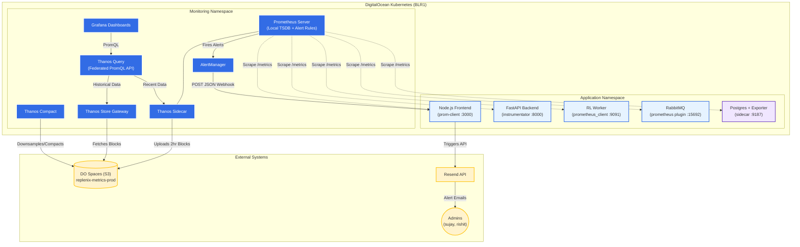

# Replenix Observability Pipeline

This document details the architecture and components of the monitoring, metrics, and alerting stack deployed to the DigitalOcean Kubernetes (DOKS) cluster.

## Architecture Diagram

The system uses **Prometheus** for short-term scraping and alerting, **Thanos** for long-term historical storage and global querying, and **Grafana** for visualization.

---

## Component Breakdown

### 1. Data Collection (Instrumentation)
Every microservice in the Replenix cluster has been instrumented to expose a standard Prometheus HTTP `/metrics` endpoint:
- **Node.js Frontend:** Uses `prom-client` to track active WebSocket connections, API request durations, and email delivery rates.
- **FastAPI Backend:** Uses `prometheus-fastapi-instrumentator` to track HTTP latency, request rates, and error rates across all REST routes.
- **RL Worker:** Uses a custom `prometheus_client` HTTP server (port 9091) to expose deep domain metrics, including `rl_best_reward` and `rl_vs_oracle_pct`.
- **Infrastructure:** RabbitMQ uses its native Prometheus plugin, while PostgreSQL uses a lightweight `postgres-exporter` sidecar.

### 2. Scraping & Alerting (Prometheus & AlertManager)
- **Prometheus** runs dynamically inside the cluster, using Kubernetes Service Monitors and Pod Annotations (`prometheus.io/scrape: "true"`) to auto-discover every pod's metrics endpoint. It scrapes them every 15 seconds.
- **AlertManager** evaluates Prometheus's recording rules (e.g., *TrainingQueueBacklog*, *RLWorkerStuck*). When a rule threshold is crossed, it fires a JSON payload to a custom webhook route (`/api/webhooks/alerts`) in the Node.js frontend.
- **Email Delivery:** Because DigitalOcean blocks outbound SMTP ports, the Node.js frontend relays the AlertManager JSON payload into styled HTML emails and routes them securely over HTTPS to the **Resend API**.

### 3. Long-Term Storage (Thanos + DO Spaces)
Prometheus is constrained by the disk size of its host node. To prevent data loss and keep cluster costs down, we use **Thanos**:
- **Thanos Sidecar:** Runs in the same pod as Prometheus. Every 2 hours, it compresses the local Prometheus TSDB blocks and uploads them securely to a cheap **DigitalOcean Spaces** bucket (`replenix-metrics-prod`).
- **Thanos Store Gateway:** When someone requests data older than a few hours, the Store Gateway streams it seamlessly from DO Spaces.
- **Thanos Compact:** Periodically downsamples historical data in the DO Spaces bucket (e.g., compressing 15-second resolution data into 5-minute averages after 30 days) to save storage costs and speed up long-term queries.
- **Thanos Query:** The central entry point. It receives PromQL queries from Grafana and intelligently routes them to the Sidecar (for fresh data) and the Store Gateway (for historical data), merging the results.

### 4. Visualization (Grafana)
Grafana sits at the top of the stack, natively querying Thanos Query. It is exposed securely at `grafana.replenix.app` and provides role-based dashboards:
- **Replenix API Health:** RED (Rate, Errors, Duration) metrics.
- **Replenix Training Operations:** Tracks RabbitMQ queue depth vs. KEDA worker count, and the RL agent's performance vs. the Oracle heuristic. 
- **Cluster Infrastructure:** Tracks CPU, Memory, and Storage PVC utilization across the DigitalOcean nodes.
