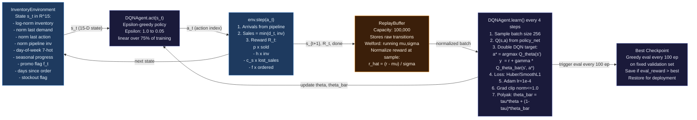
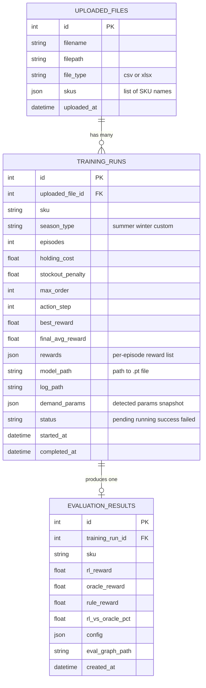

# Replenix — System Architecture Diagrams

## Diagram 1: High-Level System Architecture

```mermaid
flowchart TB
    classDef frontend fill:#1e3a5f,stroke:#4a90d9,color:#e8f4fd
    classDef api      fill:#1a3a2a,stroke:#4caf50,color:#e8f7ed
    classDef worker   fill:#3b1f0a,stroke:#ff8c00,color:#fff5e6
    classDef infra    fill:#2d1b4e,stroke:#9c27b0,color:#f3e5f5
    classDef db       fill:#1a1a3a,stroke:#5c6bc0,color:#e8eaf6
    classDef ext      fill:#2a1a1a,stroke:#ef5350,color:#fce4ec
    classDef rl       fill:#0d2b1a,stroke:#26a69a,color:#e0f2f1

    USER(["Warehouse Manager"])

    subgraph Frontend["Frontend — React / Vite / TypeScript"]
        direction LR
        S1["Stage 1: Data Ingestion\nCSV/Excel upload\nSynthetic demand gen\nSKU selector\nDetect demand params\nStage-1 LLM Copilot"]:::frontend
        S2["Stage 2: Demand Shaping\nInteractive chart editor\nAdd / remove spikes\nScale date ranges\nStage-2 LLM Copilot"]:::frontend
        S3["Stage 3: RL Training\nHyperparameter config\nLive reward chart via WS\nEpsilon decay bar\nStage-3 LLM Copilot"]:::frontend
        S4["Stage 4: Evaluation\nRL vs Oracle vs Rule\nCumulative reward table\nRL/Oracle ratio display\nStage-4 LLM Copilot"]:::frontend
        S5["Stage 5: Deployment Sim\nDay-by-day stepper\nHuman override input\nMulti-SKU KPI board\nStage-5 LLM Copilot"]:::frontend
    end

    USER --> S1 --> S2 --> S3 --> S4 --> S5

    subgraph Backend["FastAPI Backend — Python / Uvicorn"]
        direction TB
        subgraph DemandAPI["Demand API"]
            DA1["POST /demand/upload\nCSV / Excel / SKU detect"]:::api
            DA2["POST /demand/generate\nSummer or Winter synthetic"]:::api
            DA3["POST /demand/modify\nSpike / scale / reset"]:::api
            DA4["GET  /demand/params\nDetected parameters"]:::api
        end
        subgraph TrainAPI["Training API"]
            TA1["POST /train\nPublish job to RabbitMQ"]:::api
            TA2["GET  /train/status\nEpisode / reward / epsilon"]:::api
            TA3["WS   /ws/training\nLive broadcast relay"]:::api
        end
        subgraph EvalAPI["Evaluation API"]
            EA1["POST /evaluate\nRun RL + Oracle + Rule-Based"]:::api
            EA2["GET  /evaluate/results\nReturn metrics + graphs"]:::api
        end
        subgraph DeployAPI["Deployment API"]
            DP1["POST /deploy/step\nAdvance N simulation days"]:::api
            DP2["POST /deploy/override\nSet human override qty"]:::api
            DP3["GET  /deploy/status\nKPI dashboard data"]:::api
        end
        subgraph MultiAPI["Multi-SKU API"]
            MA1["POST /multi/train-all\nParallel SKU job publish"]:::api
            MA2["GET  /multi/status\nPer-SKU progress"]:::api
        end
        WSMgr["WebSocket Manager\nTrainingWSManager\nbroadcast_from_thread()"]:::api
    end

    S1 <-->|REST JSON| DemandAPI
    S2 <-->|REST JSON| DemandAPI
    S3 <-->|REST JSON| TrainAPI
    S3 <-.->|WebSocket live updates| WSMgr
    S4 <-->|REST JSON| EvalAPI
    S5 <-->|REST JSON| DeployAPI
    S3 <-->|REST JSON| MultiAPI

    subgraph RLEngine["RL Engine — Python Modules"]
        direction LR
        DemPy["demand.py\ngenerate_demand()\nBrownian motion model\npromo flag derivation"]:::rl
        EnvPy["environment.py\nInventoryEnvironment\n15-D state vector\nDiscrete action space\nLost-sales reward model"]:::rl
        DqnPy["dqn.py\nDQN: 512-512-256\nDQNAgent\nReplayBuffer + Welford\nDouble DQN / Huber loss\nPolyak tau=0.005"]:::rl
        TrPy["trainer.py\ntrain_agent()\nAdaptive Q_max + Delta\nOracle policy W=5\nRule-based s,S baseline\nGreedy eval every 100 ep"]:::rl
        DemPy --> EnvPy --> DqnPy --> TrPy
    end

    TrainAPI --> RLEngine
    EvalAPI  --> RLEngine

    subgraph MQ["RabbitMQ — Message Queue"]
        direction LR
        JobsX["jobs exchange\nTraining requests\none message per SKU"]:::infra
        ProgressX["progress exchange\nFanout broadcast\nper-episode updates"]:::infra
    end

    TA1 -->|publish training job| JobsX

    subgraph Workers["Worker Pool — Python Processes"]
        direction LR
        W1["Worker 1\nSKU-A training\n500 episodes"]:::worker
        W2["Worker 2\nSKU-B training\n500 episodes"]:::worker
        W3["Worker N\nSKU-N training\n500 episodes"]:::worker
    end

    JobsX -->|consume job| W1
    JobsX -->|consume job| W2
    JobsX -->|consume job| W3
    W1 -->|episode progress| ProgressX
    W2 -->|episode progress| ProgressX
    W3 -->|episode progress| ProgressX
    ProgressX -->|subscribe| WSMgr
    WSMgr -->|WS push events| S3

    subgraph Database["PostgreSQL — Persistent Storage"]
        direction TB
        TUF["uploaded_files\nid, filename, filepath\nfile_type, skus JSON\nuploaded_at"]:::db
        TTR["training_runs\nid, sku, season_type\nepisodes, best_reward\nrewards JSON, model_path\nstatus, started_at"]:::db
        TER["evaluation_results\nid, training_run_id\nrl_reward, oracle_reward\nrule_reward\nrl_vs_oracle_pct\neval_graph_path"]:::db
        TUF --> TTR --> TER
    end

    DemandAPI -->|persist file metadata| TUF
    TA1       -->|create TrainingRun row| TTR
    W1 -->|save weights + rewards| TTR
    W2 -->|save weights + rewards| TTR
    W3 -->|save weights + rewards| TTR
    EA1 -->|write eval metrics| TER
    DeployAPI -->|load model for sim| TTR

    subgraph External["External Services"]
        Groq["Groq API\nLlama-3.3-70B\nPage-scoped system prompts\nStage 1-5 copilots\nJSON action responses"]:::ext
    end

    S1 <-->|HTTPS LLM inference| Groq
    S2 <-->|HTTPS LLM inference| Groq
    S3 <-->|HTTPS LLM inference| Groq
    S4 <-->|HTTPS LLM inference| Groq
    S5 <-->|HTTPS LLM inference| Groq

    FileStore["File Storage\nuploads/ — CSV, Excel files\nstorage/ — model .pt weights\n          — evaluation graphs"]:::infra
    DemandAPI --> FileStore
    W1 --> FileStore
    W2 --> FileStore
    W3 --> FileStore
    EA1 --> FileStore
```

---

## Diagram 2: RL Agent Internal Data Flow

---

## Diagram 3: Database Schema

---

## Diagram 4: Stage-by-Stage Sequence Flow

```mermaid
sequenceDiagram
    actor Manager as Warehouse Manager
    participant FE as React Frontend
    participant API as FastAPI Backend
    participant MQ as RabbitMQ
    participant WK as Worker Pool
    participant DB as PostgreSQL
    participant LLM as Groq LLM

    rect rgb(20, 50, 80)
        note over Manager,LLM: Stage 1 — Data Ingestion
        Manager->>FE: Upload CSV or click Generate Summer
        FE->>API: POST /api/demand/upload or /generate
        API->>DB: INSERT uploaded_files row
        API-->>FE: UploadResponse with dates, demand, detected_params
        Manager->>FE: Ask copilot: generate 180 days winter
        FE->>LLM: System prompt with Stage-1 actions only
        LLM-->>FE: JSON action type=generate season=winter
        FE->>API: POST /api/demand/generate
        API-->>FE: ModifyResponse with new demand series
    end

    rect rgb(20, 50, 30)
        note over Manager,LLM: Stage 2 — Demand Shaping
        Manager->>FE: Drag chart spike or type command
        FE->>API: POST /api/demand/modify/spike
        API-->>FE: Updated demand series
        FE->>FE: Re-render chart with new data
    end

    rect rgb(60, 40, 10)
        note over Manager,LLM: Stage 3 — RL Training
        Manager->>FE: Configure hyperparams and click Train
        FE->>API: POST /api/train with episodes, holding_cost, decay_type
        API->>MQ: Publish job message per SKU
        API->>DB: INSERT training_runs status=pending
        API-->>FE: run_id and status initiated
        FE->>API: WS /ws/training connect
        MQ->>WK: Consume job one worker per SKU
        loop Every episode
            WK->>MQ: Publish episode progress ep,reward,epsilon,best_eval
            MQ->>API: ProgressListener callback
            API->>FE: WS broadcast episode event
            FE->>FE: Update live reward chart
        end
        WK->>DB: UPDATE training_runs with rewards and best_reward
        WK->>DB: Save model .pt path to model_path column
        WK->>MQ: Publish status=completed message
        API->>FE: WS broadcast completed event
    end

    rect rgb(20, 20, 60)
        note over Manager,LLM: Stage 4 — Evaluation
        Manager->>FE: Click Evaluate
        FE->>API: POST /api/evaluate
        API->>DB: Load model weights from training_runs
        API->>API: Run greedy RL episode epsilon=0
        API->>API: Run oracle policy W=5 day lookahead
        API->>API: Run rule-based s,S baseline
        API->>DB: INSERT evaluation_results row
        API-->>FE: rl_reward, oracle_reward, rule_reward, ratios, graphs
        FE->>FE: Render comparison table and inventory charts
    end

    rect rgb(50, 20, 50)
        note over Manager,LLM: Stage 5 — Deployment Simulation
        Manager->>FE: Click Step Day or set override
        FE->>API: POST /api/deploy/step or /deploy/override
        API->>API: DeploymentSimulator.step with RL action or override
        API-->>FE: inventory, demand, rl_action, reward, health
        FE->>FE: Update KPI dashboard and health badges
    end
```

